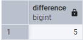
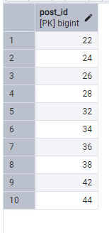
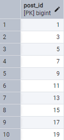

## Домашнее задание №7. SQL.

---
### Код.

№1. Количество пользователей, которые не создали ни одного поста.
```dtd
SELECT 
  (SELECT COUNT(*) FROM profile) 
  - (SELECT COUNT(DISTINCT profile_id) FROM post) AS Difference;
```

№2. Выберите по возрастанию ID всех постов, у которых 2 комментария, title начинается с цифры, а длина content больше 20 (все три условия должны соблюдаться одновременно).
```dtd
SELECT post_id
FROM (SELECT * 
  FROM post 
  WHERE (title ~ '^[0-9]+' AND LENGTH(content) > 20))
  WHERE (post_id IN
  (SELECT post_id
  FROM (
    SELECT post_id, COUNT(comment.post_id) AS comment_count 
    FROM comment GROUP BY post_id)
  WHERE (comment_count=2))
  ) ORDER BY post_id ASC;
```
№3. Выберите по возрастанию ID первых 10 постов, у которых либо нет комментариев, либо он один.
```dtd
SELECT post_id FROM post
WHERE (post_id NOT IN (
  SELECT post_id 
  FROM	(SELECT post_id, COUNT(post_id) AS comment_count FROM comment GROUP BY post_id)
WHERE comment_count > 1)) ORDER BY post_id ASC limit 10;
```
---

### Выводы.

| Задача |              Вывод              |
|:------:|:-------------------------------:|
|   1    |          |
|   2    |          |
|   3    |          |

